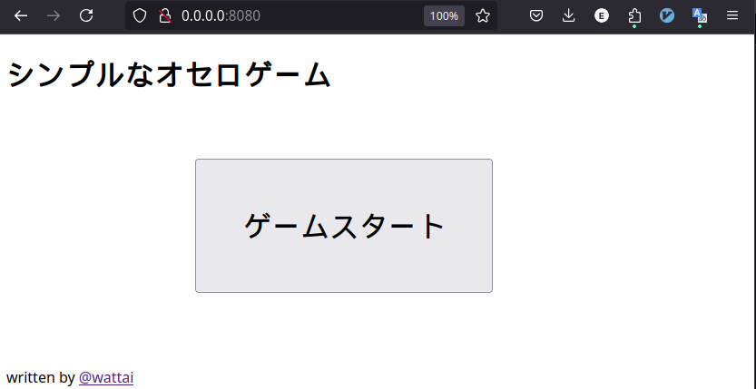
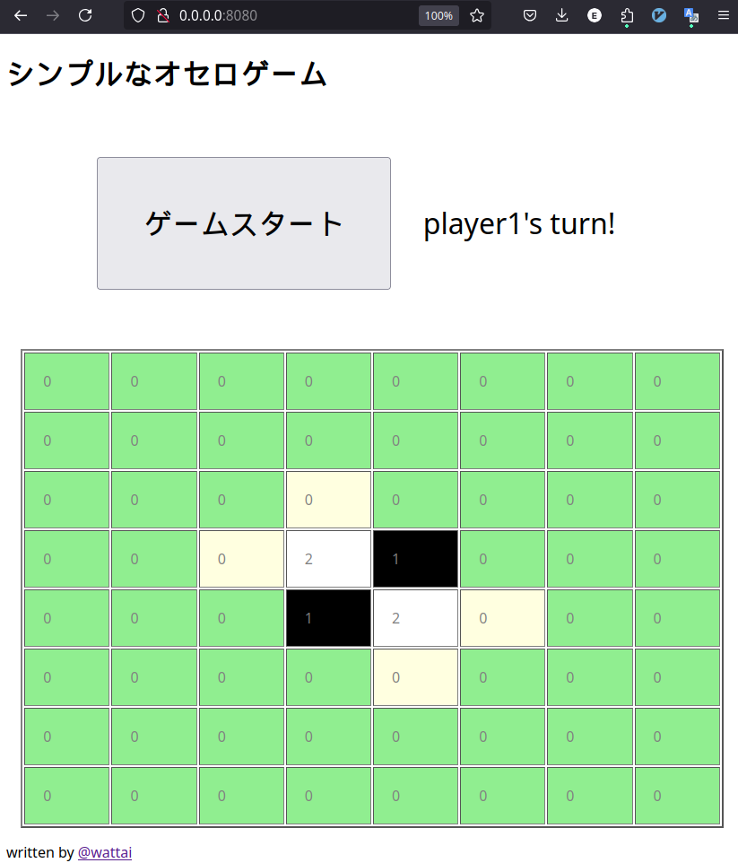

# シンプルなオセロゲーム

## 遊び方

1. 「ゲームスタート」ボタンをクリックすると、プレイヤー1 (黒) の番から開始します。
1. 石を置いてゲームを進めましょう。黄色いマスが現在のプレイヤーが石を置くことができるマスです。
1. 石が置けなくなったら勝利したプレイヤーが表示されます。再度ゲームを開始したい場合は「ゲームスタート」ボタンをクリックしてください。ゲームが初めから開始します。

## ローカルでの動作方法

以下のコマンドを実行して、Docker と nginx を使って本アプリをホストするローカルサーバーを立てることができます。

```shell
./run.sh
```

サーバーを立てた状態でブラウザから `0.0.0.0:8080` にアクセスするとアプリが立ち上がります。



「ゲームスタート」ボタンをクリックするとオセロゲームがスタートします。



サーバーを停止したい場合は以下のコマンドを実行してください。

```shell
./stop.sh
```
